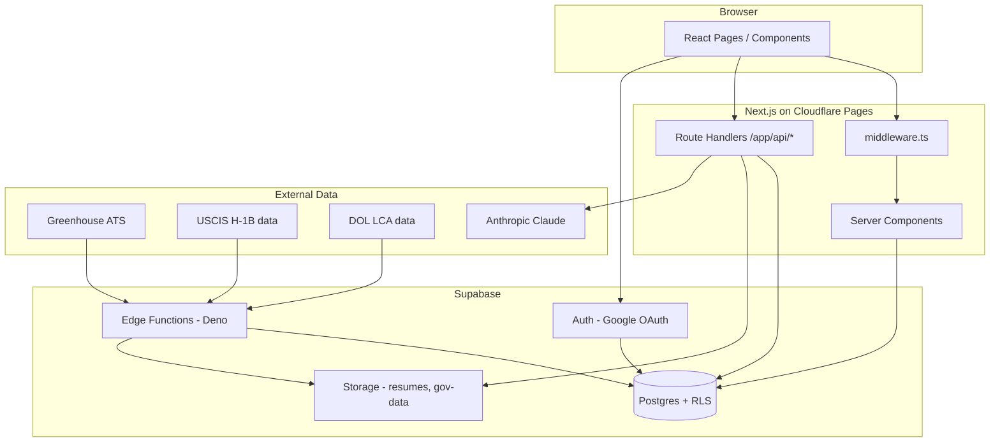

# Architecture & Backend Walkthrough

Zolve Home Base is a **job platform for H-1B visa sponsorship tracking** — helping international professionals find SWE roles at companies with verified sponsorship history.

---

## Tech Stack

| Layer | Technology |
|---|---|
| **Frontend** | Next.js 14 (App Router), React 18, TypeScript |
| **Styling** | Tailwind CSS, Lucide icons, Plus Jakarta Sans |
| **Backend / DB** | Supabase (Postgres, Auth, Storage, Edge Functions) |
| **Validation** | Zod |
| **AI** | Anthropic Claude (resume parsing) |
| **Deployment** | Cloudflare Pages via `@cloudflare/next-on-pages` + Wrangler |
| **Local tooling** | Supabase CLI, `tsx` scripts for seeding/validation |

There is **no separate backend server**. Supabase is the backend; Next.js Route Handlers and Server Components act as a thin API layer on top.

---

## Repo Structure

```
homebase/
├── app/                    # Next.js App Router pages + API routes
│   ├── (auth)/login/       # Login (Google OAuth + email/password)
│   ├── (dashboard)/        # Protected app (jobs, profile, companies, etc.)
│   ├── api/                # Route Handlers → Supabase
│   ├── auth/callback/      # OAuth callback
│   └── onboarding/         # First-time user flow
├── components/             # UI components (landing, jobs, layout, auth)
├── lib/
│   ├── supabase/           # Browser + server Supabase clients, DB types
│   ├── pipeline/           # Job/sponsor data processing logic
│   ├── greenhouse/         # Greenhouse ATS connector
│   └── search/             # Search helpers
├── supabase/
│   ├── migrations/         # Schema, RLS, Postgres functions
│   ├── functions/          # Deno Edge Functions (data pipelines)
│   └── seed.sql
├── scripts/                # Local seed + validation scripts
└── middleware.ts           # Auth + onboarding guards
```

---

## Architecture Diagram



---

## How the Backend Works

### 1. Supabase is the single source of truth

Three Supabase clients are used:

| Client | File | Purpose |
|---|---|---|
| Browser | `lib/supabase/client.ts` | Login, client-side queries |
| Server | `lib/supabase/server.ts` | Route Handlers, Server Components (cookie session) |
| Admin | `createAdminClient()` in server.ts | Privileged ops via service role key |

All data lives in Postgres with typed access via `lib/supabase/types.ts`.

---

### 2. Database schema (Postgres)

Defined in `supabase/migrations/`:

| Domain | Tables |
|---|---|
| **Companies & jobs** | `companies`, `company_aliases`, `job_postings` |
| **Gov sponsorship data** | `uscis_sponsor_records`, `dol_lca_records` |
| **Users** | `users` (extends `auth.users`), `user_education`, `user_employment`, `user_profile_completion` |
| **Behavioral** | `saved_jobs`, `job_views`, `company_views`, `applications`, `job_alerts` |

Notable Postgres features:

- **Full-text search** on jobs via `search_vector` + trigger
- **Fuzzy matching** via `pg_trgm` for company name matching
- **SQL functions** like `search_jobs()`, `get_similar_jobs()` in `003_functions.sql`
- **Triggers** for profile completion % and search vector updates

---

### 3. Row Level Security (RLS)

`002_rls.sql` enforces access at the DB level:

- **Public read**: companies, active job postings, USCIS/DOL records
- **User-owned**: profile, education, employment, saved jobs, applications — scoped to `auth.uid()`

Even if a client talks directly to Supabase, users can only mutate their own rows.

---

### 4. Auth flow

```
Login page → Supabase Auth (Google OAuth or email/password)
    ↓
/auth/callback → exchangeCodeForSession()
    ↓
New user? → insert into `users` table → /onboarding
Existing user, onboarding incomplete? → /onboarding
Otherwise → /dashboard
```

`middleware.ts` runs on every request and:

1. Refreshes the Supabase session via cookies
2. Redirects unauthenticated users away from `/dashboard`, `/profile`
3. Redirects authenticated users away from `/login`
4. Forces incomplete onboarding users to `/onboarding`

---

### 5. Next.js API routes (Route Handlers)

These are the app's backend endpoints — they authenticate, validate with Zod, then call Supabase:

| Route | Purpose |
|---|---|
| `GET /api/jobs` | Job search via `search_jobs` RPC |
| `GET /api/search` | Global search |
| `POST /api/user/onboarding` | Complete onboarding survey |
| `GET/POST /api/user/profile` | Profile CRUD |
| `POST /api/user/education`, `/employment` | Profile sections |
| `POST /api/profile/resume` | Upload resume → Storage → Claude parse → populate education/employment |
| `POST /api/jobs/[id]/save`, `/apply`, `/view` | User job interactions |
| `POST /api/companies/[id]/view` | Track company views |

Typical pattern:

```typescript
// 1. Create server Supabase client (reads session from cookies)
const supabase = await createClient()

// 2. Authenticate
const { data: { user }, error: authErr } = await supabase.auth.getUser()
if (authErr || !user) return NextResponse.json({ error: 'Unauthorized' }, { status: 401 })

// 3. Validate input with Zod
const parsed = schema.safeParse(body)

// 4. Read/write Postgres (RLS applies automatically)
await supabase.from('users').update({ ... }).eq('id', user.id)
```

Job search delegates heavy lifting to Postgres via RPC:

```typescript
const { data, error } = await supabase.rpc('search_jobs', {
  query: q,
  p_visa_types: visaTypes.length ? visaTypes : null,
  p_limit: limit,
  p_offset: offset,
})
```

---

### 6. Supabase Edge Functions (background data pipelines)

These run on Supabase's Deno runtime, **not** in Next.js:

| Function | Role |
|---|---|
| **`greenhouse-sync`** | Pulls SWE jobs from Greenhouse ATS boards → upserts into `job_postings`, marks stale jobs inactive |
| **`gov-data-ingest`** | Ingests USCIS + DOL CSV/TSV from Storage → fuzzy-matches to `companies` |
| **`compute-sponsor-score`** | Recomputes `sponsor_score` (0–100) per company from USCIS/LCA data |

Data pipeline flow:

```
External sources (Greenhouse, USCIS, DOL)
    ↓
Supabase Edge Functions (scheduled or manual invoke)
    ↓
Postgres tables (job_postings, uscis_sponsor_records, dol_lca_records)
    ↓
compute-sponsor-score → companies.sponsor_score updated
    ↓
Next.js reads via RPC/API → UI shows sponsor badges, filters, rankings
```

Scoring logic also lives in `lib/pipeline/sponsor-score.ts`.

---

### 7. Storage

Supabase Storage buckets:

| Bucket | Purpose |
|---|---|
| **`resumes`** | User resume uploads (parsed by Claude in `/api/profile/resume`) |
| **`gov-data-raw`** | Raw government CSV files for ingestion |

---

## Request Flow Examples

### Browsing jobs

```
/jobs page → fetch /api/jobs?q=...&visa_types=...
    → createClient() (server)
    → supabase.rpc('search_jobs', ...)
    → Postgres joins job_postings + companies, ranks by text match + sponsor_score
    → JSON → JobCard components
```

### Saving a job (logged in)

```
User clicks Save → POST /api/jobs/[id]/save
    → getUser() from session cookie
    → INSERT into saved_jobs (RLS ensures user_id = auth.uid())
```

### Resume upload

```
POST /api/profile/resume (multipart form)
    → Upload file to Storage bucket `resumes`
    → Send text to Claude Haiku for structured extraction
    → Upsert user_education + user_employment
    → Update users.resume_url
    → Trigger recomputes profile completion %
```

---

## Frontend Routing

| Route group | Access | Pages |
|---|---|---|
| `/` | Public | Landing page |
| `/login` | Public | Auth |
| `/onboarding` | Auth required | First-time survey |
| `/(dashboard)/*` | Auth + onboarding complete | Dashboard, jobs, profile, companies, upskill, etc. |
| `/jobs/[jobId]` | Public | Individual job detail |

Dashboard layout (`app/(dashboard)/layout.tsx`) is a Server Component that fetches the user from Supabase and wraps pages in Navbar + Sidebar.

---

## Key Takeaway

The backend is **Supabase-centric**:

1. **Postgres** holds all data + business logic (search, scoring triggers, RLS)
2. **Auth** handles sessions; Next.js middleware enforces route protection
3. **Next.js Route Handlers** are a thin validation/auth layer over Supabase
4. **Edge Functions** handle async data ingestion (jobs + gov data) outside the web app
5. **Claude** is only used for resume parsing — everything else is SQL + TypeScript

There is no Express/FastAPI/custom server.
